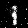

# Generative Adversarial Nets 

This is a PyTorch implementation of the paper [Generative Adversarial Nets](https://arxiv.org/abs/1406.2661) by Ian Goodfellow et al. 

## Paper Review 

G: Generative model, D: Discriminative model.

- G: Generate data that is indistinguishable from the real data.
- D: Distinguish between real data and data generated by G.

The training process is a zero-sum game between G and D.

- G: Minimize log(1 - D(G(z)))
- D: Minimize log(D(x)) + log(1 - D(G(z)))

min_G max_D V(D, G) = E_x~p_data(x)[log(D(x))] + E_z~p_z(z)[log(1 - D(G(z)))] (1)

Where p_data(x) is the distribution of the real data, and p_z(z) is the distribution of the noise.

The training process is to find the Nash equilibrium of the game.

for number of iterations:
    for k steps:
        - Sample minibatch of m noise samples {z^(1), ..., z^(m)} from noise prior p_z(z).
        - Sample minibatch of m examples {x^(1), ..., x^(m)} from data generating distribution p_data(x).
        - Update the discriminator by ascending its stochastic gradient:
            - ∇_θ_D (1/m) ∑_i=1^m [log(D(x^(i))] + log(1 - D(G(z^(i)))].

    - Sample minibatch of m noise samples {z^(1), ..., z^(m)} from noise prior p_z(z).
    - Update the generator by descending its stochastic gradient:
        - ∇_θ_G (1/m) ∑_i=1^m log(1 - D(G(z^(i))). 

In summary, the training process is to update the discriminator to better distinguish between real data and data generated by the generator, and to update the generator to generate data that is indistinguishable from the real data. Discriminator is updated k times more than the generator to prevent the generator from overpowering the discriminator.

## Implementation

The generator and discriminator are both convolutional neural networks. The generator takes a noise vector as input and outputs an image. The discriminator takes an image as input and outputs a probability that the image is real. Used MNIST dataset for training.

Generator and Discriminator architectures are in the `models.py` file. The training process is in the `train.py` file. The `main.py` file is used to run the training process. The `utils.py` file contains utility functions. 

Sample generated images from epochs 1, 100, and 200: 

   

## References

- [Generative Adversarial Nets](https://arxiv.org/abs/1406.2661) by Ian Goodfellow et al.