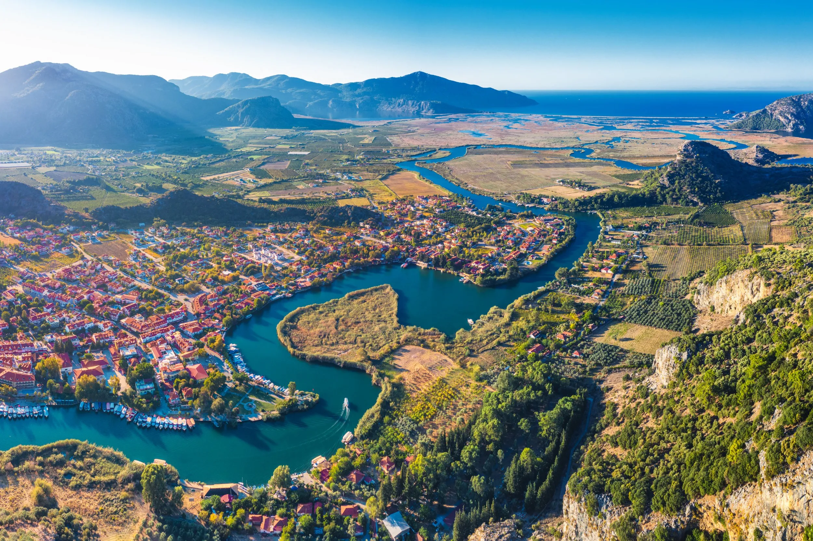

# A Neural Algorithm of Artistic Style

This is the [PyTorch](https://pytorch.org/) implementation of the paper [A Neural Algorithm of Artistic Style](https://arxiv.org/abs/1508.06576) by Leon A. Gatys, Alexander S. Ecker, and Matthias Bethge. The paper presents an algorithm for combining the content of one image with the style of another image using convolutional neural networks.

## Paper Review 

A 19 layer VGG network is used to extract content and style features from the input images. The content features are extracted from the higher layers of the network, while the style features are extracted from the lower layers. The content and style losses are then computed using the mean squared error between the features of the input images and the features of the content and style images, respectively. The total loss is a weighted sum of the content and style losses, and the input image is optimized to minimize this loss using gradient descent.

Instead of max pooling, average pooling is used to avoid the loss of spatial information. The style loss is computed using the Gram matrix of the feature maps, which captures the correlations between the different features. The content loss is computed using the feature maps directly.

Squared-error loss is used to compute the content and style losses. The total loss is a weighted sum of the content and style losses, and the input image is optimized to minimize this loss using gradient descent.

Minimising the distance of a white noise image from the content image and the style image, while keeping the content and style losses low, results in a new image that has the content of the content image and the style of the style image.

LossTotal = α * LossContent + β * LossStyle

Where α and β are the weights for the content and style losses, respectively.

You can find the loss function code in the `losses.py` file. 

## Example

The original image is a photo of Dalyan. The style image is a painting by Van Gogh. The transformed image is the result of combining the content of the original image with the style of the style image.

  