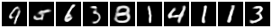

# Auto-Encoding Variational Bayes

This is a [PyTorch](http://pytorch.org/) implementation of the VAE model described in the paper [Auto-Encoding Variational Bayes](https://arxiv.org/abs/1312.6114) by Kingma and Welling. The model is trained on the MNIST dataset.

## Paper Review

This paper is published in ICLR 2014. The authors of this paper are Diederik P. Kingma and Max Welling. The main contribution of this paper is the introduction of the variational autoencoder (VAE) model, which is a generative model that combines variational inference with autoencoding. The model is trained using the reparameterization trick, which allows the model to be trained using backpropagation. The model is trained on the MNIST dataset and is able to generate realistic images of handwritten digits. The paper also introduces the concept of the evidence lower bound (ELBO), which is used to optimize the model. The paper demonstrates that the VAE model can be used for various tasks such as image generation, image inpainting, and semi-supervised learning.

Consider a dataset X = {x1, ..., xn} of n i.i.d. observations from some unknown distribution p(x|θ), where θ is a parameter of the distribution. The goal of the VAE is to learn a generative model p(x|z, θ) of the data, where z is a latent variable, in which latent variable means the hidden variable. 

Encoder and Decoder are two main components of VAE. The encoder is a neural network that takes an input x and outputs a distribution q(z|x) over the latent variable z. The decoder is a neural network that takes a sample z from the distribution q(z|x) and outputs a distribution p(x|z) over the data variable x. The VAE is trained by maximizing the evidence lower bound (ELBO) with respect to the model parameters θ and φ, where φ are the parameters of the encoder and decoder. The ELBO is given by:

L(θ, φ; x) = E[log p(x|z)] - D(q(z|x)||p(z))

where the first term is the reconstruction loss and the second term is the KL divergence between the encoder distribution q(z|x) and the prior distribution p(z). The VAE is trained using the reparameterization trick, which allows the model to be trained using backpropagation. The reparameterization trick is used to sample z from the distribution q(z|x) by sampling ε from a standard normal distribution and then computing z = μ + σε, where μ and σ are the mean and standard deviation of the distribution q(z|x).

Therefore, loss function for training a VAE has two components:

1. Reconstruction loss: This term encourages the decoder to generate samples that are similar to the input data. The reconstruction loss is given by the negative log-likelihood of the data under the decoder distribution p(x|z), which is equivalent to the cross-entropy loss between the input data and the output of the decoder. 

2. KL divergence:  This term regularizes the latent space by measuring the divergence between the encoder's distribution and a standard Gaussian distribution. Minimizing the KL divergence encourages the latent space to be well-structured and continuous, which is desirable for generative models. Large KL divergence means that the latent space is not well-structured and continuous. 

The VAE is trained by minimizing the combined loss (reconstruction loss + KL divergence) using stochastic gradient descent. 

Summary: Learn a latent space that captures the underlying factors of variation in the data, while also being regularized to be continuous and well-structured. The VAE is a generative model that can be used for various tasks such as image generation, image inpainting, and semi-supervised learning.

## Implementation 

The VAE model is implemented using PyTorch. The model consists of an encoder and a decoder, which are both implemented as neural networks. The encoder takes an input image and outputs the mean and standard deviation of the distribution q(z|x) over the latent variable z. The decoder takes a sample z from the distribution q(z|x) and outputs the reconstructed image. The model is trained using the reparameterization trick, which allows the model to be trained using backpropagation. The model is trained on the MNIST dataset and is able to generate realistic images of handwritten digits. 

The code for the VAE model is implemented in the file `vae.py`. The model is trained using the file `train.py`, which also contains the code for loading the MNIST dataset. 

## Generated Digits Visualization

The image below demonstrates the output of a Variational Autoencoder (VAE) trained on the MNIST dataset. It displays 10 digits generated by the VAE by sampling from the latent space after the model has been trained for 10 epochs.

The purpose of this visualization is to show the VAE's capability in capturing the essential characteristics of the handwritten digits and to generate new data points that are nearly indistinguishable from the actual dataset.

